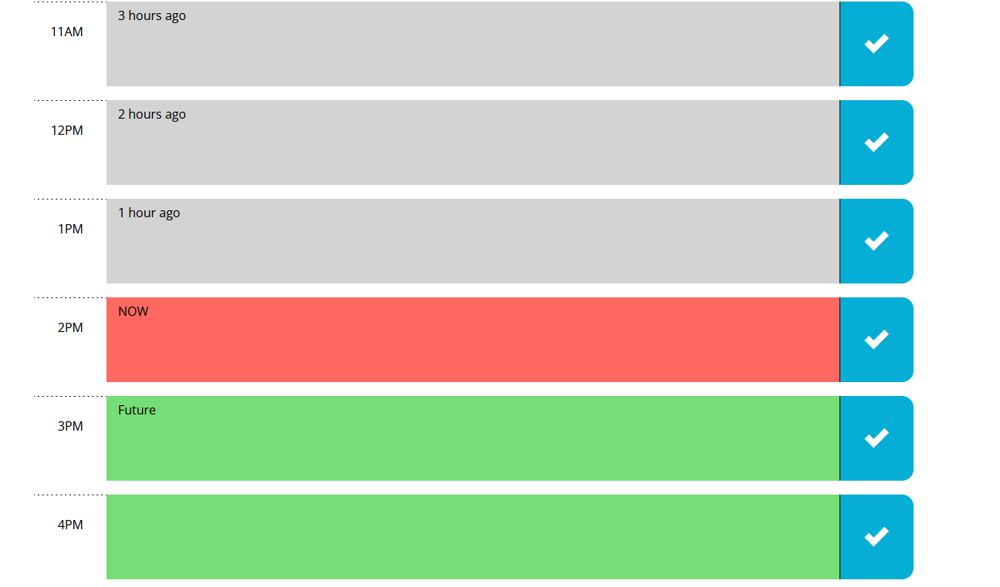

# Work Day Scheduler 

## Description
A tool to help you organize your work day!
Hours are from 9am-5pm.

## Usage
Each hour has a designated task box. Click on a colored box to type
a task into the time slot. To save the task, click the blue box
with the checkmark.

On refresh all saved tasks will appear as you left them.

The colored boxes are a visual representation of the past, present,
and future. Time slots in the past are brown, in red is the current
hour, and in green are the timeslots ahead of the current hour.

The color of the tasks update automatically every ten minutes, or immediately whenever you refresh the page.

The current date is displayed at the top of the page in the header.
Updated every 10 minutes or on refresh as well.

## Made With
* HTML
* CSS
* JavaScript
* jQuery
* Moment.js
* Bootstrap

## Website
https://chance-crawford.github.io/WorkDayScheduler/